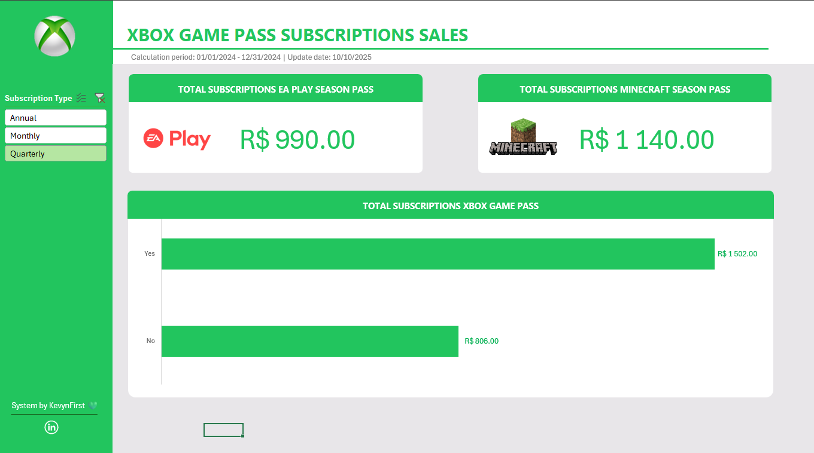

  

  <a href="#-tecnologias">Tecnologias</a>&nbsp;&nbsp;&nbsp;|&nbsp;&nbsp;&nbsp;
  <a href="#-projeto">Projeto</a>&nbsp;&nbsp;&nbsp;|&nbsp;&nbsp;&nbsp;
  <a href="#-preview">Preview</a>

 

## 🚀 Tecnologias

Esse projeto foi desenvolvido com a ferramenta microsoft [excel](https://www.microsoft.com/pt-br/microsoft-365/excel).

   
   

## 📖 Projeto

Este projeto faz parte da prática do curso [Excel com inteligência artificial](https://ebaconline.com.br/analista-de-dados), da plataforma Dio.me. O objetivo deste desafio é criar um dashboard de vendas, com foco na organização da **metodologia ABCDE** (Assets, Bases, Calculation, Dashboard e Extras) e visualização de dados intuitiva. O objetivo é transformar dados brutos em informações visuais claras e úteis, permitindo uma análise eficaz do desempenho de vendas e a tomada de decisões baseadas em dados.
 
 

## 🖥 Preview

  

### Como Executar

Basta baixar o arquivo em .xlsx [aqui](https://github.com/KevynFirst/Xdashboard-excel/blob/ee14764d6ef5f0fcfdd3db480391cc70fd219fb3/dashboard-xbox.xlsx). 👈🏻

 

## 😉 Obrigado por visitar meu projeto

Você pode conferir outros projetos que desenvolvi aqui no meu GitHub, ou entrar em contato comigo pelos demais links.

